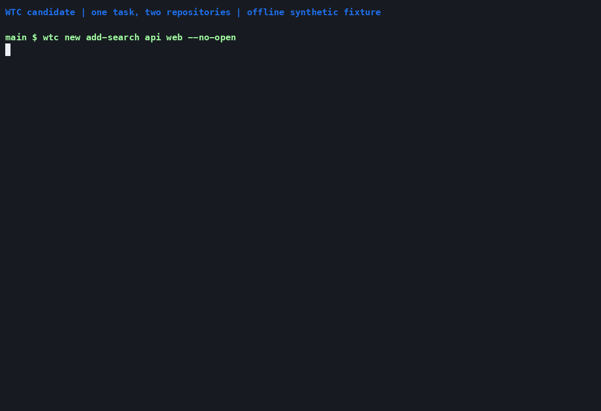
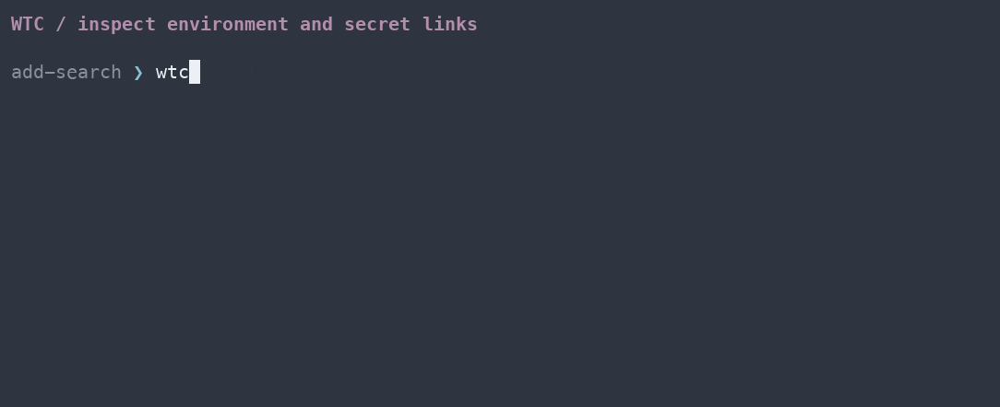
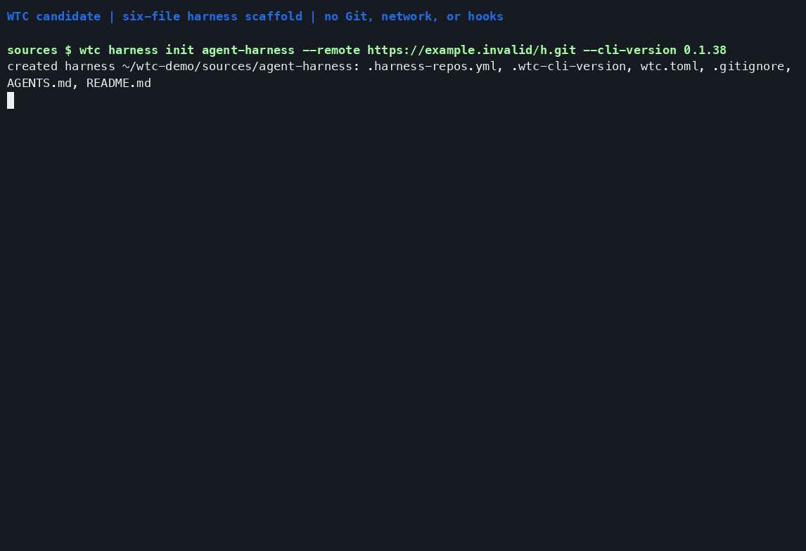

<div align="center">

<h1>wtc</h1>
<p><strong>One task. One workspace. All your repositories.</strong></p>
<p>Git worktree collections for working across repositories, with agents or your favorite editor.</p>

<p>
  <a href="https://github.com/lcorneliussen/wtc-cli/releases"></a>
  <a href="https://github.com/lcorneliussen/wtc-cli/actions/workflows/ci.yml"></a>
</p>

<p>
  <a href="docs/getting-started.md"><strong>Get started</strong></a> ·
  <a href="#see-it-in-action"><strong>Watch the demos</strong></a> ·
  <a href="docs/commands.md"><strong>Command reference</strong></a>
</p>

</div>

A **worktree collection** puts the repositories needed for one task in a single
folder: your API, frontend, shared library, and a project-owned harness. Open
an agent or editor there and work across them. Start another task alongside it
with its own worktrees and ports.

WTC manages the workspace around your projects: Git worktrees, environment,
agent guidance, PR status, and cleanup. Projects keep their usual build and
run commands.

| Work across repos | Keep tasks separate | See where things stand |
| --- | --- | --- |
| Bring the repos you need into one folder. Add another whenever the task grows. | Each collection gets its own Git worktrees, environment, and port assignments. | Check local changes and PRs together, then retire the collection when the task is done. |

## See it in action

Real commands, recorded with the candidate binary against synthetic local repos.

### One task, two repositories

Create a collection with API and web worktrees. Open the live TUI with
`wtc status`, then make a frontend edit and refresh the view.

[](docs/demos/collections.gif)

[Read the transcript](docs/demos/collections.txt) · [Asciicast](docs/demos/collections.cast)

### Environment and secrets at a glance

`wtc env list` and `wtc secrets list` open interactive inventories. Browse
variable names, source scopes, and secret link states; values stay hidden.

[](docs/demos/inventories.gif)

[Read the transcript](docs/demos/inventories.txt) · [Asciicast](docs/demos/inventories.cast)

### A six-file harness

Scaffold the registry, CLI pin, configuration, and entry points your project
owns. Standard collection guidance comes from the CLI.

**Preview:** the small harness scaffold is being tested on this branch and is
not available in v0.1.38. Follow [getting started](docs/getting-started.md) for
the released setup path.

[](docs/demos/harness.gif)

[Read the transcript](docs/demos/harness.txt) · [Asciicast](docs/demos/harness.cast) · [Reproduce the recordings](docs/demos/README.md)

## Get started

Install a [published release](https://github.com/lcorneliussen/wtc-cli/releases)
for macOS or Linux. With mise:

```sh
mise use -g github:lcorneliussen/wtc-cli@0.1.38
```

Then follow [getting started](docs/getting-started.md) to set up your first
workspace with a harness. The
[reference harness](https://github.com/lcorneliussen/wtc-boilerplate) is an
optional starter you can adapt.

An existing harness pins its CLI in `.wtc-cli-version`. `wtc env setup`
generates collection-local mise configuration from that pin and the harness's
`[mise.tools]`; run `mise install` in the collection. Your project toolchains
can continue to use their own mise files.

## Work in a collection

From an existing collection:

```sh
wtc new fix-login api web
cd ../fix-login
wtc status
wtc add-repo shared
# Make changes, commit, and open PRs in each repository.
wtc retire .
```

Worktrees start detached at their development tip. Create a branch before
committing. Retirement checks for local work before removing worktrees;
remote branches remain available.

Use an ordinary editor and terminal, or `wtc open` for a herdr workspace with
agent, browse, shell, and status panes. `/wtc-start` is the agent orientation
procedure.

## Your harness, your workflow

| Location | Responsibility |
| --- | --- |
| `wtc-cli` | Collection operations, standard instructions and skills, bootstrap tooling |
| Your harness repo | Repository registry, CLI pin, tool configuration, project policy and hooks |
| Your application repos | Normal development commands; optional WTC adapters |
| Each collection | Generated environment and agent files, local overrides |

A harness is versioned project configuration. It does not need to be a fork
of a large template. Read the [harness design](docs/harness-design.md) for the
migration boundary and the role of the boilerplate.

## Go deeper

| Guide | What's inside |
| --- | --- |
| [Command reference](docs/commands.md) | Collection operations and CLI options |
| [Configuration and hooks](internal/wtc/defaults/instructions/customize.md) | Adapt the harness to your project |
| [Workspace geometry](internal/wtc/defaults/instructions/worktree-workspace.md) | Collections, sibling repos, and shared Git owners |
| [Environment and ports](internal/wtc/defaults/instructions/hooks-and-env.md) | Collection environment, mise, and port assignments |
| [Secrets](internal/wtc/defaults/instructions/secrets.md) | Shared credential files and worktree links |
| [Agent instructions and skills](internal/wtc/defaults/instructions/skills.md) | Project guidance and collection procedures |
| [Development and validation](docs/development.md) | Build, test, and contribute to WTC |

The installed customization guide is available with `wtc customize`.
The candidate also exposes all embedded guidance through `wtc docs`.
