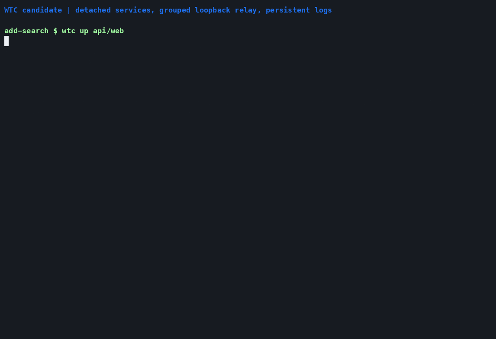
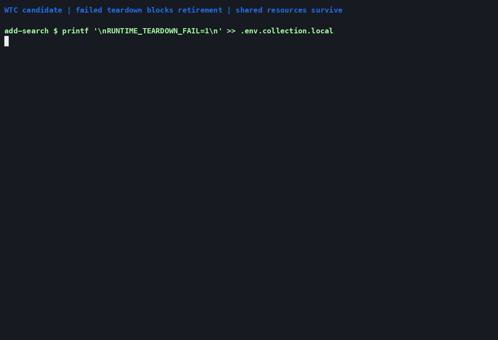

# Recorded WTC demos

These terminal recordings run real commands against fresh synthetic Git repos.
The small harness scaffold requires v0.1.39 or newer. No
service runner, forge account, desktop session, or agent is needed.

## One task, two repositories

Run `wtc new add-search api web`, then open the live view with `wtc status`.
Quit with `q`, make a frontend edit, and refresh with `r`.
No flags are needed to choose the interactive view in a terminal.


[Transcript](collections.txt) · [Asciicast](collections.cast)

## Environment and secret inventories

Browse `wtc env list` and `wtc secrets list` with their default TUIs. Move the
selection to inspect names, scopes, and link states. Environment values and
credential contents are never shown; the fixture files contain synthetic data.


[Transcript](inventories.txt) · [Asciicast](inventories.cast)

## Small harness scaffold

Create six project-owned files without initializing Git, contacting a remote,
installing tools, or running hooks. The harness owns its registry and pins;
standard collection instructions come from the CLI. The two flags shown here
are required: the remote to record and the exact CLI version to pin.


[Transcript](harness.txt) · [Asciicast](harness.cast)

## Runtime candidate

The next two recordings use the opt-in dekit runtime, which no released CLI
contains yet. They are recorded by `record_runtime.py` (see below).

### Services, grouped endpoints, and logs

Start an existing build-and-run command and its loopback relay as one group.
Read their status and logs, restart with the cached build, then stop processes.
The synthetic owned data folder and append-only logs remain after `down`.



[Transcript](runtime.txt) · [Asciicast](runtime.cast)

The relay runs on the same machine. It demonstrates grouping and dependencies;
it does not demonstrate cross-machine access or a cloud provider. Replace it
with the project's existing foreground tunnel command for real onboarding.

### Cleanup failure

A deliberate resource teardown failure blocks retirement and preserves the
worktrees. Correct the override and retry: owned resources and the collection
are removed, while a synthetic shared resource marker remains.



[Transcript](cleanup.txt) · [Asciicast](cleanup.cast)

## Reproduce

Build the CLI, then supply Python 3, Git, and `pyte` 0.8.2 for capturing
readable TUI screen transcripts. The optional
[agg](https://github.com/asciinema/agg) 1.9.0 executable converts casts to GIFs:

```sh
go build -o ./wtc ./cmd/wtc
python3 -m venv /tmp/wtc-demo-venv
/tmp/wtc-demo-venv/bin/pip install pyte==0.8.2
/tmp/wtc-demo-venv/bin/python docs/demos/record.py --wtc ./wtc --agg /path/to/agg
```

Omitting `--agg` records only casts and transcripts. The script uses fresh local
fixture repos and an explicit environment, and removes its temporary workspace.
Normal bootstrap clones your harness from its forge remote.

GIFs use the Nord palette, 20px monospace text, and an 88 × 16 terminal.
Commands are typed at a readable pace; output and TUI updates are captured
live from a real pseudoterminal. The last TUI stays visible at the end of the
recording; the script sends `q` and waits for the process to exit afterward.
TUI transcripts contain the actual screen just before quitting, with repeated
blank rows collapsed, rather than raw cursor-control sequences.

The v0.1.39 pin is fixture metadata only: every command uses the supplied
source-built binary. No pin is installed or changed in your projects. Captures
replace only their own temporary sandbox path with `~/wtc-demo`; transcripts
also normalize terminal whitespace. Inspect all captures before publishing.

### Runtime recordings

The runtime and cleanup recordings need dekit 0.10.0 and use their own script:

```sh
python3 docs/demos/record_runtime.py \
  --wtc ./wtc --dekit /path/to/dekit --agg /path/to/agg
```

It creates its own temporary repos and owners, launches only loopback services,
and removes its fixture. The relay runs on the same machine; it shows grouping
and dependencies, not cross-machine access or a cloud provider.
